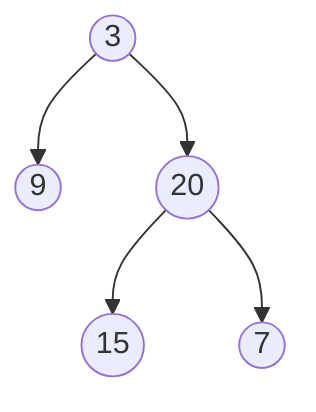
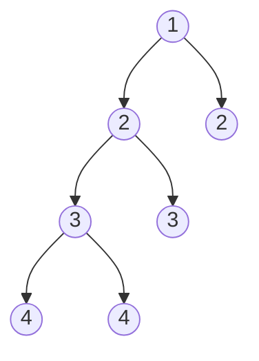

### [剑指 Offer 55 - II. 平衡二叉树](https://leetcode.cn/problems/ping-heng-er-cha-shu-lcof/)

输入一棵二叉树的根节点，判断该树是不是平衡二叉树。如果某二叉树中任意节点的左右子树的深度相差不超过`1`，那么它就是一棵平衡二叉树。

 

**示例 1:**

> 给定二叉树 [3,9,20,null,null,15,7]
返回 true 。




**示例 2:**

> 给定二叉树 [1,2,2,3,3,null,null,4,4]
> 返回 false 。



参考题解：[后序遍历+剪枝](https://leetcode.cn/problems/ping-heng-er-cha-shu-lcof/solution/mian-shi-ti-55-ii-ping-heng-er-cha-shu-cong-di-zhi/) 
 

```java
/**
 * Definition for a binary tree node.
 * public class TreeNode {
 *     int val;
 *     TreeNode left;
 *     TreeNode right;
 *     TreeNode(int x) { val = x; }
 * }
 */
class Solution {
    public boolean isBalanced(TreeNode root) {
        int res = recur(root);
        return res == -1 ? false : true;
    }

    private int recur(TreeNode root){
        if (root == null){
            return 0;
        }
        int left = recur(root.left);
        if (left == -1){
            return -1;
        }
        int right = recur(root.right);
        if (right == -1){
            return -1;
        }
        if (Math.abs(left - right) <= 1){
            return Math.max(left, right) + 1;
        }
        return -1;
    }
}
```