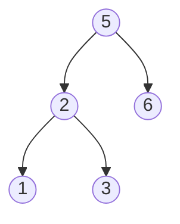

引言：单调栈的练习推荐这份题单--->[百题选手突破题单（1）](https://leetcode.cn/circle/article/DOIPfB/)

### [503. 下一个更大元素 II](https://leetcode.cn/problems/next-greater-element-ii/)

给定一个循环数组 `nums `（ `nums[nums.length - 1]` 的下一个元素是 `nums[0] `），返回 `nums` 中每个元素的 **下一个更大元素** 。

数字 `x` 的 **下一个更大的元素** 是按数组遍历顺序，这个数字之后的第一个比它更大的数，这意味着你应该循环地搜索它的下一个更大的数。如果不存在，则输出 `-1` 。

**示例 1:**
>输入: nums = [1,2,1]
输出: [2,-1,2]
解释: 第一个 1 的下一个更大的数是 2；
数字 2 找不到下一个更大的数； 
第二个 1 的下一个最大的数需要循环搜索，结果也是 2。

**示例 2:**
>输入: nums = [1,2,3,4,3]
输出: [2,3,4,-1,4]

```py
class NextGreaterElement:
    def nextGreaterElements2(self, nums: List[int]) -> List[int]:
        n = len(nums)
        stk, res = [], [-1] * n
        for i in range(n * 2):
            while stk and nums[stk[-1]] < nums[i % n]:
                idx = stk.pop()
                res[idx] = nums[i % n]
            stk.append(i % n)
        return res
```

### [901. 股票价格跨度](https://leetcode.cn/problems/online-stock-span/)

编写一个 `StockSpanner` 类，它收集某些股票的每日报价，并返回该股票当日价格的跨度。

今天股票价格的跨度被定义为股票价格小于或等于今天价格的最大连续日数（从今天开始往回数，包括今天）。

例如，如果未来7天股票的价格是 `[100, 80, 60, 70, 60, 75, 85]`，那么股票跨度将是 `[1, 1, 1, 2, 1, 4, 6]`。

 

**示例：**

```java
输入：["StockSpanner","next","next","next","next","next","next","next"], [[],[100],[80],[60],[70],[60],[75],[85]]
输出：[null,1,1,1,2,1,4,6]
解释：
首先，初始化 S = StockSpanner()，然后：
S.next(100) 被调用并返回 1，
S.next(80) 被调用并返回 1，
S.next(60) 被调用并返回 1，
S.next(70) 被调用并返回 2，
S.next(60) 被调用并返回 1，
S.next(75) 被调用并返回 4，
S.next(85) 被调用并返回 6。

注意 (例如) S.next(75) 返回 4，因为截至今天的最后 4 个价格
(包括今天的价格 75) 小于或等于今天的价格。
```


```java
public class StockSpanner {

    private Deque<Integer> stk;
    private Deque<Integer> weights;

    public StockSpanner() {
        stk = new ArrayDeque<>();
        weights = new ArrayDeque<>();
    }


    public int next(int price) {
        int w = 1;
        while (!stk.isEmpty() && stk.peekLast() <= price){
            stk.pollLast();
            w += weights.pollLast();
        }
        stk.offerLast(price);
        weights.offerLast(w);
        return w;
    }
}
```

```py
class StockSpanner:

    def __init__(self):
        self.stk = []


    def next(self, price: int) -> int:
        w = 1
        while self.stk and self.stk[-1][0] <= price:
            stock, weight = self.stk.pop()
            w += weight
        self.stk.append((price, w))
        return w
```


### [剑指 Offer 33. 二叉搜索树的后序遍历序列](https://leetcode.cn/problems/er-cha-sou-suo-shu-de-hou-xu-bian-li-xu-lie-lcof/)

输入一个整数数组，判断该数组是不是某二叉搜索树的后序遍历结果。如果是则返回 `true`，否则返回 `false`。假设输入的数组的任意两个数字都互不相同。

参考以下这颗二叉搜索树：




**示例 1：**

> 输入: [1,6,3,2,5]
输出: false

**示例 2：**

> 输入: [1,3,2,6,5]
输出: true

```java
class Solution {
    public boolean verifyPostorder(int[] postorder) {
        Deque<Integer> stk = new ArrayDeque<>();
        int pre = Integer.MAX_VALUE;
        for (int i = postorder.length - 1; i>= 0; i--){
            int num = postorder[i];
            if (num > pre){
                return false;
            }
            while (!stk.isEmpty() && num < stk.peek()){
                pre = stk.pop();
            }
            stk.push(num);
        }
        return true;
    }
}
```