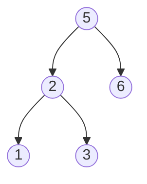

### [剑指 Offer 33. 二叉搜索树的后序遍历序列](https://leetcode.cn/problems/er-cha-sou-suo-shu-de-hou-xu-bian-li-xu-lie-lcof/)

输入一个整数数组，判断该数组是不是某二叉搜索树的后序遍历结果。如果是则返回 `true`，否则返回 `false`。假设输入的数组的任意两个数字都互不相同。

参考以下这颗二叉搜索树：




**示例 1：**

> 输入: [1,6,3,2,5]
输出: false

**示例 2：**

> 输入: [1,3,2,6,5]
输出: true

```java
class Solution {
    public boolean verifyPostorder(int[] postorder) {
        Deque<Integer> stk = new ArrayDeque<>();
        int pre = Integer.MAX_VALUE;
        for (int i = postorder.length - 1; i>= 0; i--){
            int num = postorder[i];
            if (num > pre){
                return false;
            }
            while (!stk.isEmpty() && num < stk.peek()){
                pre = stk.pop();
            }
            stk.push(num);
        }
        return true;
    }
}
```